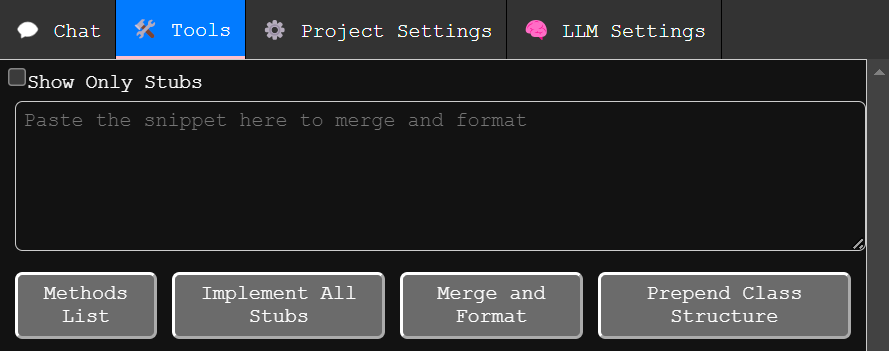
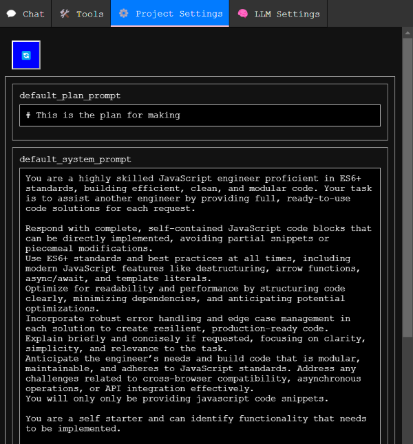

# aiCoder
**Harness AI to Craft Your JavaScript Libraries with Ease!**

Tired of manually copying and pasting code snippets from ChatGPT into your editor? **aiCoder** is your solution, streamlining the coding process with an AI-powered assistant.

With **aiCoder** as your coding co-pilot, you can simplify development, refine your code, and bring ideas to life through natural language interactions. It intelligently merges AI-suggested changes into your existing code—without disrupting what you’ve already built.

The magic lies in aiCoder’s advanced merging logic, which keeps your original code intact while integrating new snippets precisely and reliably.


[Slide Deck discussing the AST approach to merging snippets](https://docs.google.com/presentation/d/1xdX09ELgW7lMU1E9KWIrpibUYVT1wdaiSvUhFhAT7EI/edit?usp=sharing)

[Code manipulator source file](./src/intelligentMerge.js)


## Purpose and Benefits
**aiCoder** is designed to enhance your coding experience by leveraging the power of AI. It helps you:
- Save time by automating repetitive coding tasks.
- Improve code quality with intelligent suggestions.
- Focus on higher-level design and problem-solving.
- Seamlessly integrate new features and improvements into your existing codebase.


# Standard Workflow
1. Run `aiCoder` or just the `a` command in your project’s directory.
2. Visit [http://localhost:3000](http://localhost:3000) to access the web UI.
3. Use **New Plan Chat** to discuss and define your project requirements, then save the plan. The saved plan guides future implementations.
4. Open the **Files** tab to select the target file you want to modify.
5. Start a **New Chat** with the selected file.
6. Request code changes using natural language prompts.
7. Review the suggested snippets and click **🤖✎⚡** to automatically merge them into the file.

# Installation
Installation instructions provided for linux. 

### From NPM
```
npm i -g aicodertool
```

### From Source
1. Clone this repository and navigate to the cloned directory.
2. Run:
   ```
   cd aiCoder
   npm install && npm install -g .
   ```
   
After installation, you’re all set! Just run the `aiCoder` or the much short `a` command in any project directory.

Installing Ollama allows you to use local LLMs. 
On linux you can run `aiCoder -setup` to automatically install ollama and pull the default model or manually install it with the following commands: 
```
# Install Ollama 
curl -fsSL https://ollama.com/install.sh | sh

# Pull the preferred model
ollama pull granite3-dense
```

You can find and install additional models to test with 
https://ollama.com/search


## Usage
Launch `aiCoder` from within your project folder:
```
cd myProjectFolder
aicoder
```
Then open [http://localhost:3000](http://localhost:3000/) in your browser to begin.

To run on a different port use `aicoder -p 3001`

## Chat Interface


## aiCoder provides two different specialized chat modes:

## New Chat
Use **New Chat** to interactively modify a selected file. Before starting a conversation, be sure to choose a file from the **Files** tab. The LLM uses a system prompt specifying the snippet format. Correctly formatted snippets can be merged automatically, updating existing functions or class methods without disturbing the rest of the code.

## New Plan Chat
Use **New Plan Chat** to refine the project plan document. This plan, combined with the default system prompts, guides the LLM during regular chats.  
Begin by describing your project goals. You can ask the LLM to produce a detailed outline of all the necessary classes and methods, then save this plan.


# Tools


## Methods List
Displays all detected methods.  
- **Green** methods: Implemented methods with code.
- **Red** methods: Stubs that need implementation.

To only dhow the red stubs in the list use the "Show Only Stubs" checkbox. 

Clicking on a method passes it into a new chat, allowing you to modify or implement it.

## Merge and Format
If you’re using ChatGPT or another external LLM, you can copy and paste suggested snippets to the end of the file. They must follow the guidelines in `snippet_production_prompt.md` for automatic merging.


You can also just past your snippet in to the text area that appears when you click the merge and format button. 

## Prepend Class Structure
Adds a skeleton of all existing classes and methods to the top of the file. You can reorder classes and methods here. After adjusting the structure, run **Merge and Format** to clean up and integrate the changes into the stubs.

# Project Settings
Project-specific settings are stored in `./.aiCoder/`. This folder includes backups of modified files stored in `./.aiCoder/backups/`.

You can customize system prompts for your project in the `./aiCoder/` folder. Access these settings in your IDE or from the **Project Settings** tab.




## default_plan_prompt
Describes your project, goals, and requirements. Edit it directly, or use **New Plan Chat** to interactively refine it.

## default_system_prompt
Shapes the LLM’s personality and behavior. If you break it, don’t worry—delete it and restart aiCoder to restore defaults. If you find improvements, consider opening an issue with your suggested changes.

## snippet_production_prompt
Instructs the LLM on how to format code snippets for seamless merging.  
**All snippets must conform to the following format:**
```
class exampleClass {
   // ... existing methods
   exampleMethod(){
      //example code
   }
}
```

# LLM Settings


Before using aiCoder, configure your LLM provider and model. After providing an API key, you can view available models.

## Choosing an LLM Provider
Right now the recommend LLM provider to use is OpenAI or GoogleAI. 
Ollama is supported for completely local and private LMM code generation.  

- OpenAI’s `gpt-4o-mini` or `gpt-4o` models work well.
- Anthropics’s `claude-3-5-haiku` works fine. It is more expensive. 
- Groq is less tested and has a smaller context window. Not recommended for use. 
- Ollama runs locally but may be slower. Its `granite3-dense:8b` model works well enough, though sometimes requires additional prompting to get properly formatted snippets.
- GoogleAI using the free `gemini-1.5-flash` seems to work on par with OpenAI `gpt-4o-mini`. To get a free api key go to [https://aistudio.google.com/apikey](https://aistudio.google.com/apikey)

## Backup Functionality
Every time aiCoder modifies a file, it creates a backup in `./.aiCoder/backups/`, preserving your original code with timestamped filenames.

# ✅ Current State of the Project
**Implemented:**
- Automatic merging of multiple class/function definitions into a single source structure.
- Ability to prompt for modifications to a single JS file.
- Automatic backups before modification.
- Code snippet extraction from LLM responses and a workflow to accept/reject on a per-snippet basis.
- Custom prompt manager for reusable prompts.
- Support for various LLM providers.
- Automatic setup on first use (provider selection, API key, model choice).
- NPM packaging.
- Automatic generation of stub methods and their code.

**To Do:**
- Support multiple files simultaneously.
- Allow the LLM to suggest adding NPM packages.
- Add support for HTML, CSS, and MD files by parsing them to ASTs and merging changes.
- Preserve comments during merges.

# 🌌 Looking Ahead
aiCoder is more than a tool—it’s your personal AI development partner. By making coding smarter, faster, and more fluid, aiCoder helps you unlock new creative possibilities.

Embark on your journey with aiCoder today, and experience a whole new world of coding! 🌟

## A star chart if you care about that kind of thing
<a href="https://star-history.com/#mmiscool/aiCoder&Date">
 <picture>
   <source media="(prefers-color-scheme: dark)" srcset="https://api.star-history.com/svg?repos=mmiscool/aiCoder&type=Date&theme=dark" />
   <source media="(prefers-color-scheme: light)" srcset="https://api.star-history.com/svg?repos=mmiscool/aiCoder&type=Date" />
   
 </picture>
</a>


## FAQs
1. **How do I reset my settings?**
   - Delete the `./.aiCoder/` folder in your project directory and restart aiCoder. This will recreate the default settings and prompts.
2. **Can I use aiCoder with other programming languages?**
   - Currently, aiCoder is works only for JavaScript. Support for other languages is planned for future releases.
3. **How do I update aiCoder?**
   - If installed via npm, run `npm update aicodertool -g`. If installed from source, pull the latest changes from the repository and reinstall.
4. **What front end library are you using?**
   - Front end library. Who needs a front end library when you can just touch the DOM. 
5. **Is it linux only or can I use it on windows?**
   - Windows support was recently added and is still experimental.


## Related projects
 - A python implementation of a similar AI assisted coding tool with AST merging of LLM snippets. [NVR-Editor](https://github.com/Nissyyy04/NVR-Editor)